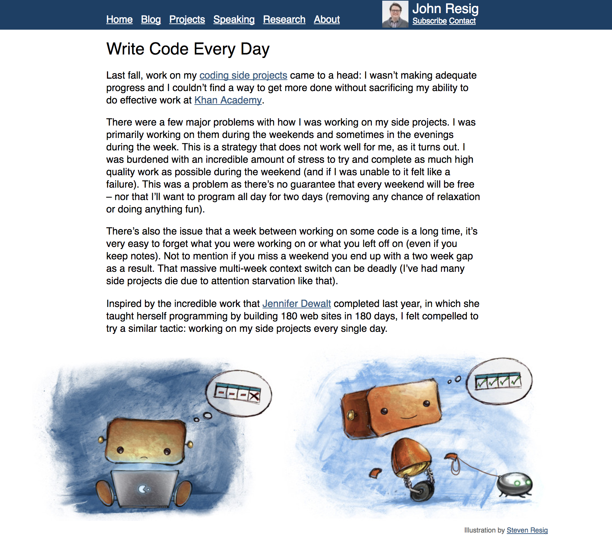

# コミットステータス

SS <- コレ

---

# コミットステータス

- CI サービスを連携しているとコミットを自動で評価して返してくれる
- よく使われているサービス (自分調べ)
  - Travis (テスト), Circle (テスト), Codecov (カバレッジ)

---
# ステータスが赤くなった場合

- CI サービスのログを読み取ってなぜ落ちたか調べる
- 自分せいじゃない場合もしばしばある
  - コメントで自分のせいじゃないと主張する
  - 確率的に落ちているぽかったらリトライしてみるのもあり

---
class: center, middle
# コントリビューションを増やす方法

---
class: center, middle
# PR counts

---
class: center, middle
# commit counts

---
class: center, middle
# 大抵の人が
## PR 投げた数 <<< Commit 数

---
class: center, middle
# 大抵の人が
## 勝手に作ったものを公開している

---
class: center, middle
### なんでも良いのでとにかく作りましょう

---
class: center, middle
# Write Code Every Day

---
# John Resig

- jQuery 作者
- なんでも良いから毎日何か書くというプラクティスを実践
- インデントのみ修正とかはダメ、何か意味のあるものを書く
- 書いたものは全て GitHub で OSS にする

---
# John Resig

- このプラクティスを始める前は**週末**にまとめて書こうとして**失敗し続けた**
- **毎日**やることで自然なリズム感が生まれるらしい。

---
class: center, middle
# なんでも良いので毎日何か作ると良いらしいです。

---
class: center, middle, inverse
# Write OSS Every Day

