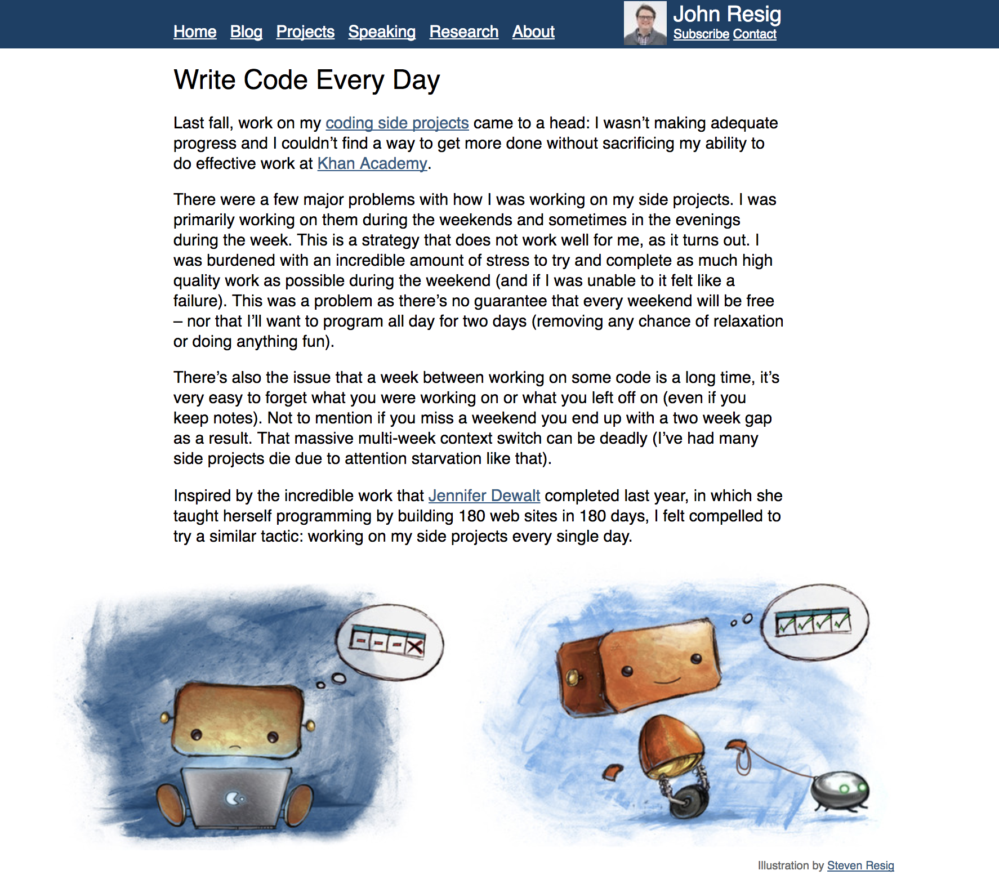

class: center, middle, inverse
# JavaScript OSS Contribution Guide

日野澤歓也 (@kt3k)

---
# 自己紹介 - 日野澤歓也


- ひのさわ よしや
- github: **@kt3k**
- twitter: **@kt3k**
- qiita: **@kt3k**
- HP: **kt3k**.org

---
# @kt3k エンジニア歴

- 2009 -> 2010 MIU
- 2010 -> 2012 ZYYX
- 2012 -> 2014 **GREE**
- 2015 -> 2017 フリーランス
  - 主なパートナ: **Recruit**さん **CureApp**さん

---
# @kt3k エンジニア歴

- 2009 -> 2010 MIU
- 2010 -> 2012 ZYYX
- 2012 -> 2014 **GREE**
- 2015 -> 2017 フリーランス
  - 主なパートナ: **Recruit**さん **CureApp**さん
- ↑ ざっくりまとめると全部 Web を作る仕事

---
class: center
# @kt3k GitHub 2017

---
class: center
# @kt3k GitHub 2016

---
class: center
# @kt3k GitHub 2015

---
class: center
# @kt3k GitHub 2014

---
class: center
# @kt3k GitHub 2013


---
class: center, middle, inverse
# JavaScript OSS Contribution Guide

---
# Agenda

- OSS に PR を出すときのチェックポイント
  - 1
  - 2
  - 3
  - 4
  - 5
- Contribution を増やす方法

---
# Pull Request (PR)
- OSS に PR を出す時、いろいろな**摩擦**が生じうる
- PR を送る上で様々な**お作法**が存在しそれを守ることでマージされやすい PR になったり、マージしづらい PR になったりする

---
class: center, middle, inverse
# チェックポイントその1/5

# Lint

---
# Lint

- ソースコードのスタイルチェック
- プロジェクトごとに異なるルール設定がある
- どうやってリントしてるかを読み取る
  - CLI を直接叩くパターン
  - タスクランナーから起動するパターン (grunt, gulp etc)
  - etc

---
# 例1 Vuejs (package.json)

```
{
  ...,
  "scripts": {
    ...,
    "lint": "eslint src build test",
    ...
  }
}
```

- package.json の run script で書くパターン
- 一番分かりやすい (npm run lint で実行)

---
# 例2 Grunt (Gruntfile.js)

```
grunt.initConfig({
  ...
  eslint: {
    gruntfile_tasks: ['Gruntfile.js', 'internal-tasks/*.js'],
    libs_n_tests: ['lib/**/*.js', '<%= nodeunit.all %>'],
    subgrunt: ['<%= subgrunt.all %>']
  }
  ...
})
```
- ↑ grunt eslint で実行できる
- ちょっと古めのフロント系 module で多い

---
# 例3 Nodejs (Makefile)

```
jslint:
	@echo "Running JS linter..."
	$(NODE) tools/eslint/bin/eslint.js --cache --rulesdir=tools/eslint-rules --ext=.js,.md \
	benchmark doc lib test tools
```

- ↑ make jslint で実行できる
- node 黎明期からあるような PJ で多い
  - ex. (ちょっと前までの) mocha

---
# もし Lint が壊れていたら

## [Sails](https://github.com/balderdashy/sails/pull/3380)
- 修正を提案してみた

---
# もし Lint が壊れていたら

## [Sails](https://github.com/balderdashy/sails/pull/3380)
- 修正を提案してみた
- No thanks!


---
# もし Lint が壊れていたら

## [SVGO](https://github.com/svg/svgo/pull/382)
- 修正を提案してみた

---
# もし Lint が壊れていたら

## [SVGO](https://github.com/svg/svgo/pull/382)
- 修正を提案してみた
- No thanks!


---
# Lint の例外

- Lint に興味がないコミュニティもある
  - 文化を尊重してそっとしておこう 😉

---
class: center, middle, inverse
# チェックポイントその2/5

# テスト

---
# テスト
- まずテストの実行方法を読み取る
  - 普通は npm test で実行できる
  - Makefile (node, mocha) だったり Gruntfile に書いてるとこがたまにある

---
# テスト
- テストが通らない場合は、とにかく通すまで頑張る
  - CI がある場合は、CI の設定を参考にする
- ローカルでどうしても通せない場合はごまかすしかない
  - テストがきちんとメンテされていない repo は contribute しづらい
  - テストちゃんとメンテしましょう

---
# どのくらいテストを書くべきか
- バグを直す場合
  - そのバグを再現するテストケースを追加する
- 機能を足す場合
  - その機能のテストを足す

---
# バグのテストの例
## [SCEditor](https://github.com/samclarke/SCEditor/pull/533)

---
# バグのテストの例
## [SCEditor](https://github.com/samclarke/SCEditor/pull/533)
- ↑ 実装の差分からは何を修正しているか、作者でも絶対に分からない (ぐらい実装が**複雑**)
- 既存及び追加分のテストが通っているのでマージできた(と思っています)

---
# 機能のテストの例
## [nvm](https://github.com/creationix/nvm/pull/189)

---
# 機能のテストの例
## [nvm](https://github.com/creationix/nvm/pull/189)
- 機能のテストの場合、似たようなテストがない場合もあるためハードルが若干上がる

---
# テスト
- テストを書くことで非常に細かい粒度で何を修正しているのかを明示できる
- 作者の熱量が下がっていて、もう実装を覚えていない場合でもマージされる可能性が高くなる

---
class: center, middle, inverse
# チェックポイントその3/5

# コミットメッセージ

---
# コミットメッセージ

- コミットメッセージにルールがあるレポジトリが増えてきている
  - ex. ESLint, node.js, angular, babel etc
- 標準ルール的なものは(多分)ない
- とりあえず最新10コミット程度眺めてルールがありそうかどうかを察する

---
# Nodejs のルール

- 1行目 subsystem 名でタグ付け (例. stream, fs, doc, test etc)
- 1行目 50桁以内, 全て小文字, 動詞原形はじまり
- 2行目 空行
- 3行目以降 72桁以内, 対応する issue にリファレンス

---
# Nodejs コミットコメント[例](https://github.com/nodejs/node/commit/8ca322d6134c21901f200b7f00340426548ac543)

```
commit 8ca322d6134c21901f200b7f00340426548ac543
Author: Yoshiya Hinosawa <stibium121@gmail.com>
Date:   Sat Nov 12 16:26:52 2016 +0900

    test: improve test-stream2-objects.js

    This commit improves the test cases in
    test-stream2-objects.js by using assert.strictEqual
    instead of assert.equal.
```

---
# ESLint のルール

- 1行目 コミットの種別でタグ付け (例. Fix, New, Docs etc)
- 1行目 対応する issue を閉じれる場合は Fixes #N で参照, 関連するが解決しない場合は、refs #N で参照
- 2行目 空行
- 3行目以降 72桁以内

---
# ESLint コミットコメント[例](https://github.com/eslint/eslint/commit/6390862e02650d1eafe111f11184fd4a7726fbce)

```
commit 6390862e02650d1eafe111f11184fd4a7726fbce
Author: Yoshiya Hinosawa <stibium121@gmail.com>
Date:   Sun Jan 10 00:19:46 2016 +0900

    Docs: Fix missing footnote
```

---
# コミットメッセージにルールがあるところ

- 大型 PJ に多い
- 個人でやってるところは滅多にない
- Changelog の自動生成を採用する (くらい開発が活発な) PJ の場合に必要になってくる

---
class: center, middle, inverse
# チェックポイントその4/5

# コミットステータス (CI)

---

# コミットステータス

SS <- コレ

---

# コミットステータス

- CI サービスを連携しているとコミットを自動で評価して返してくれる
- よく使われているサービス (自分調べ)
  - Travis (テスト), Circle (テスト), Codecov (カバレッジ)

---
# ステータスが赤くなった場合

- CI サービスのログを読み取ってなぜ落ちたか調べる
- 自分せいじゃない場合もしばしばある
  - コメントで自分のせいじゃないと主張する
  - 確率的に落ちているぽかったらリトライしてみるのもあり

---
class: center, middle, inverse
# チェックポイントその5/5

# メンテナ居ない問題

---
# メンテナが *居ない* とは

---
# メンテナが *居ない* とは

---
# メンテナが *居ない* 場合

- どうしようもない
- PR を出すと時間の無駄になる
  - -> ***そっ閉じ*** するしかない

---
# メンテナ居ない問題

- 放置率が高いメンテナ (自分調べ)
  - sub○tack
  - isa○cs
  - hug○sk

---
# Eric Raymond - The Cathedral & The Bazaar
- When you lose interest in a program, your last duty to it is to hand it off to a competent successor.
- あるプログラムに対する興味を失った時、あなたの最後の義務は適切な後継者に引き渡すこと

---
class: middle, center, inverse
# ちゃんと引き継ごう

---
# PR チェックポイントまとめ
1. Lint に従う
1. テストを書く
1. コミットメッセージをチェック
1. コミットステータスをチェック
1. メンテナがいるかチェック

---
class: center, middle
# ちなみに

---
class: center, middle
## いきなり全部やるのはハードルが高そうと思った人 ✋

---
class: center, middle
# OSS コントリビューションの練習ができるイベントのご紹介

---
class: center, middle, inverse
# Node 学園祭 2017
# "Code and Learn" コーナー

---
# Code and Learn

- ワークショップ形式で **Node.js (本体)** にみんなでコミットする
- コミットするお題はオーガナイザがストックの中から選ばせてくれる

---
class: center, middle
### 去年の Code and Learn で Node.js に
### コントリビュートできた人の数

# 18人

---
class: center, middle
# 東京 Node 学園祭 2017
11/25, **11/26**

---
class: center, middle
### ✨🐢🚀✨

---
class: center, middle
# コントリビューションを増やす方法

---
class: center, middle
# PR counts

---
class: center, middle
# commit counts

---
class: center, middle
# 大抵の人が
## PR 投げた数 <<< Commit 数

---
class: center, middle
# 大抵の人が
## 勝手に作ったものを公開している

---
class: center, middle
### なんでも良いのでとにかく作りましょう

---
class: center, middle
# Write Code Every Day


---
# John Resig

- jQuery 作者
- なんでも良いから毎日何か書くというプラクティスを実践
- インデントのみ修正とかはダメ、何か意味のあるものを書く
- 書いたものは全て GitHub で OSS にする

---
# John Resig

- このプラクティスを始める前は**週末**にまとめて書こうとして**失敗し続けた**
- **毎日**やることで自然なリズム感が生まれるらしい。

---
class: center, middle
# なんでも良いので毎日何か作ると良いらしいです。

---
class: center, middle, inverse
# Write OSS Every Day

---
class: center, middle
## ご静聴ありがとうございました
