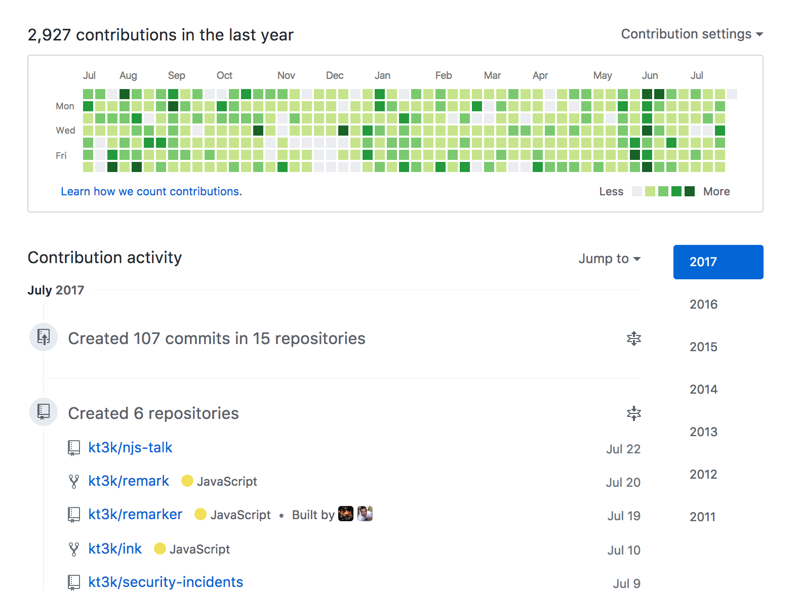
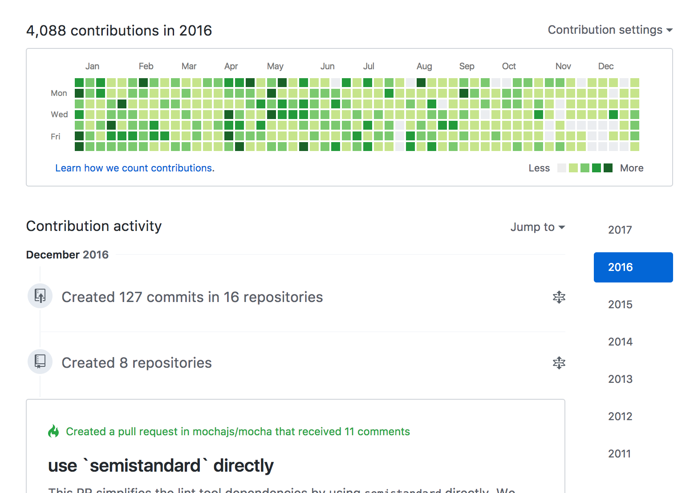
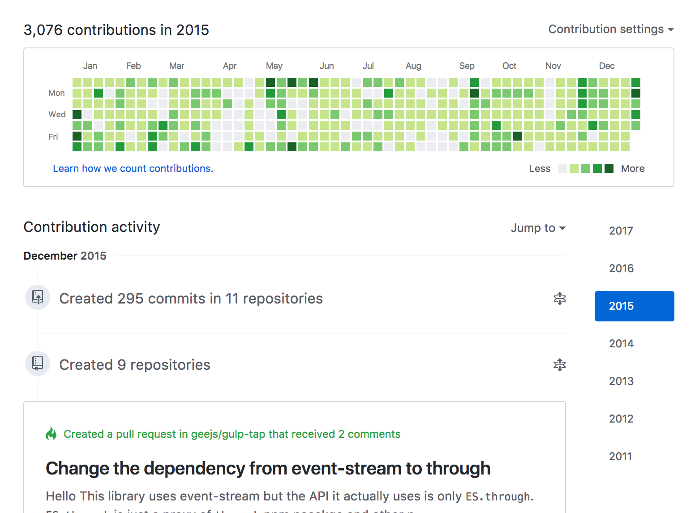
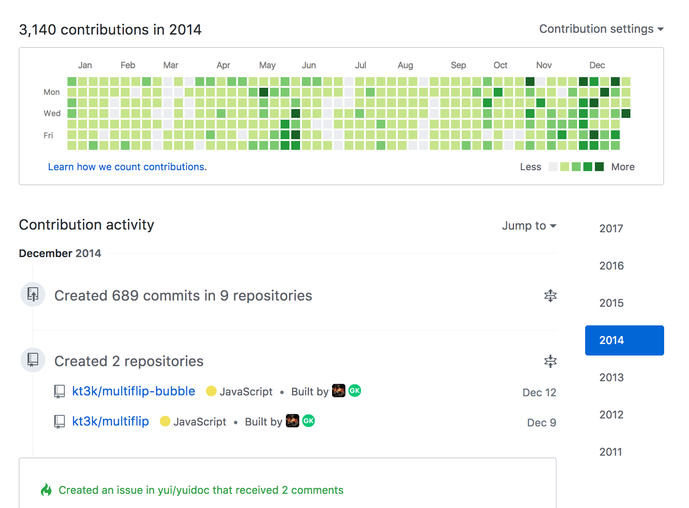
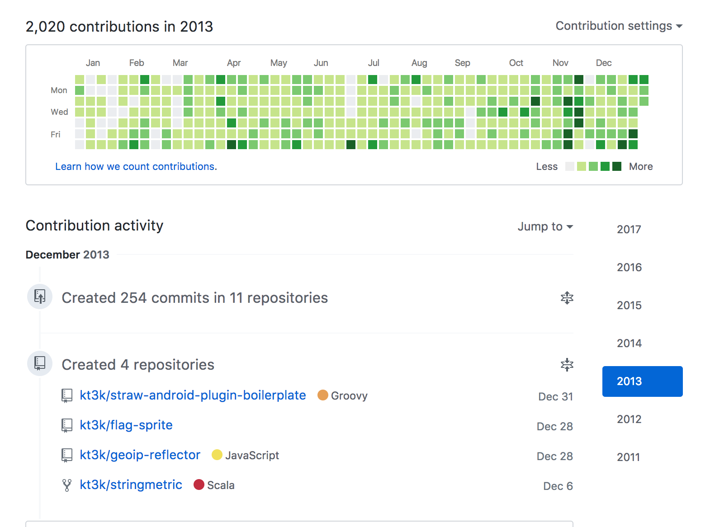
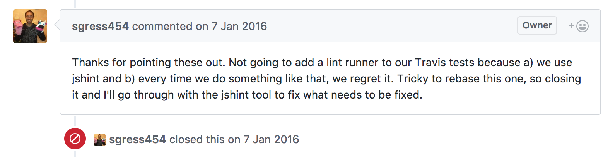
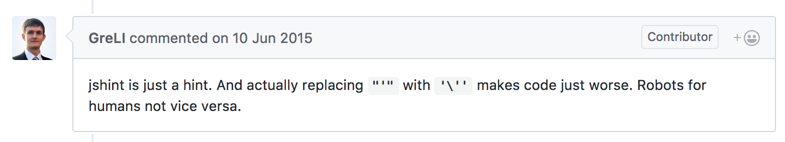
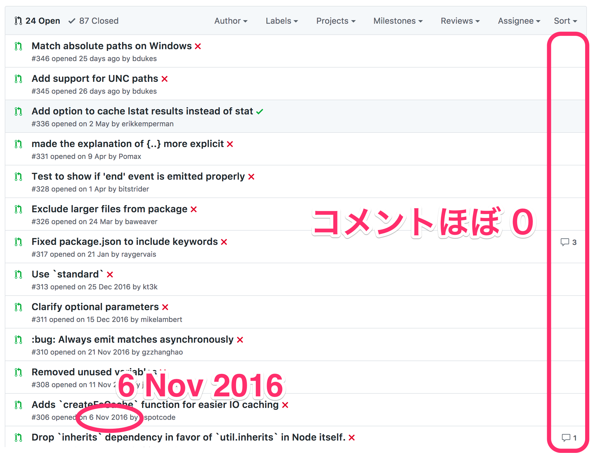

class: center, middle, inverse
# JavaScript OSS Contribution Guide

日野澤歓也 (@kt3k)

---
# 自己紹介 - 日野澤歓也


- ひのさわ よしや
- github: **@kt3k**
- twitter: **@kt3k**
- qiita: **@kt3k**
- HP: **kt3k**.org

---
# @kt3k エンジニア歴

- 2009 -> 2010 MIU
- 2010 -> 2012 ZYYX
- 2012 -> 2014 **GREE**
- 2015 -> 2017 フリーランス
  - 主なパートナ: **Recruit**さん **CureApp**さん

---
# @kt3k エンジニア歴

- 2009 -> 2010 MIU
- 2010 -> 2012 ZYYX
- 2012 -> 2014 **GREE**
- 2015 -> 2017 フリーランス
  - 主なパートナ: **Recruit**さん **CureApp**さん
- ↑ ざっくりまとめると全部 Web のお仕事

---
class: center
# @kt3k GitHub 2017

---
class: center
# @kt3k GitHub 2016

---
class: center
# @kt3k GitHub 2015

---
class: center
# @kt3k GitHub 2014

---
class: center
# @kt3k GitHub 2013


---
class: center, middle, inverse
# JavaScript OSS Contribution Guide

---
# Agenda

- OSS に PR を出すときのチェックポイント
  - 1
  - 2
  - 3
  - 4
  - 5

---
# Pull Request (PR)
- OSS に PR を出す時、いろいろな**摩擦**が生じうる
- PR を送る上で様々な**お作法**が存在しそれを守ることでマージされやすい PR になったり、マージしづらい PR になったりする

---
class: center, middle, inverse
# チェックポイントその1/5
# 　
---
class: center, middle, inverse
# チェックポイントその1/5

# Lint

---
# Lint

- ソースコードのスタイルチェック
- プロジェクトごとに異なるルール設定がある
- どうやってリントしてるかを読み取る
  - CLI を直接叩くパターン
  - タスクランナーから起動するパターン
  - (例. grunt, gulp etc)

---
# 例1 Vuejs (package.json)

```
{
  ...,
  "scripts": {
    ...,
    "lint": "eslint src build test",
    ...
  }
}
```

- package.json の run script で書くパターン
- 一番分かりやすい (npm run lint で実行)

---
# 例2 Grunt (Gruntfile.js)

```
grunt.initConfig({
  ...
  eslint: {
    gruntfile_tasks: ['Gruntfile.js', 'internal-tasks/*.js'],
    libs_n_tests: ['lib/**/*.js', '<%= nodeunit.all %>'],
    subgrunt: ['<%= subgrunt.all %>']
  }
  ...
})
```
- ↑ grunt eslint で実行できる
- ちょっと古めのフロント系 module で多い

---
# 例3 Nodejs (Makefile)

```
jslint:
	@echo "Running JS linter..."
	$(NODE) tools/eslint/bin/eslint.js --cache --rulesdir=tools/eslint-rules --ext=.js,.md \
	benchmark doc lib test tools
```

- ↑ make jslint で実行できる
- node 黎明期からあるような PJ で多い
  - ex. mocha

---
# もし Lint が壊れていたら

## [Sails](https://github.com/balderdashy/sails/pull/3380)
- 修正を提案してみた

---
# もし Lint が壊れていたら

## [Sails](https://github.com/balderdashy/sails/pull/3380)
- 修正を提案してみた
- No thanks!


---
# もし Lint が壊れていたら

## [SVGO](https://github.com/svg/svgo/pull/382)
- 修正を提案してみた

---
# もし Lint が壊れていたら

## [SVGO](https://github.com/svg/svgo/pull/382)
- 修正を提案してみた
- No thanks!


---
# Lint の例外

- Lint に興味がないコミュニティもある
  - 文化を尊重してそっとしておこう 😉

---
class: center, middle, inverse
# チェックポイントその2/5

# テスト

---
# テスト
- まずテストの実行方法を読み取る
  - 普通は npm test で実行できる
  - Makefile (node, mocha) だったり Gruntfile に書いてるとこがたまにある

---
# テスト
- テストが通らない場合は、とにかく通すまで頑張る
  - CI がある場合は、CI の設定を参考にする
- ローカルでどうしても通せない場合はごまかすしかない
  - 自分の書いたテストだけ通ればよしとする
  - 他のテストは見なかったことにする

---
# どのくらいテストを書くべきか
- バグを直す場合
  - そのバグを再現するテストケースを追加する
- 機能を足す場合
  - その機能のテストを足す

---
# バグのテストの例
## [SCEditor](https://github.com/samclarke/SCEditor/pull/533)

---
# バグのテストの例
## [SCEditor](https://github.com/samclarke/SCEditor/pull/533)
- SCEditor はあまりアクティブにはメンテされていない
- パーサの実装もかなり自由な感じで、作者は実装を覚えていないはず
- 既存及び追加分のテストが通っていることを持ってマージしたと思われる

---
# テスト
- テストを書くことで非常に細かい粒度で何を修正しているのかをメンテナに対して示すことができる
- 作者の熱量が下がっていて、もう実装を覚えていない場合でもマージされる可能性が高くなる

---
class: center, middle, inverse
# チェックポイントその3/5

# 　　
---
class: center, middle, inverse
# チェックポイントその3/5

# コミットメッセージ

---
# コミットメッセージ

- コミットメッセージにルールがあるレポジトリが増えてきている
  - ex. ESLint, node.js, angular, babel etc
- 標準ルール的なものは(多分)ない
- とりあえず最新10コミット程度眺めてルールがありそうかどうかを察する

---
# Nodejs のルール

- 1行目 subsystem 名でタグ付け (例. stream, fs, doc, test etc)
- 1行目 50文字以内, 全て小文字, 動詞原形はじまり
- 2行目 空行
- 3行目以降 72文字以内, 対応する issue にリファレンス

---
# Nodejs コミットコメント例

```
test: improve test-stream2-objects.js

This commit improves the test cases in
test-stream2-objects.js by using assert.strictEqual
instead of assert.equal.
```
---
# Nodejs コミットコメント例

```
test: improve test-stream2-objects.js

This commit improves the test cases in
test-stream2-objects.js by using assert.strictEqual
instead of assert.equal.
```

- ルールは多いがルールを守ること自体は難しくない

---
# コミットメッセージにルールがあるところ

- 大型 PJ に多い
- **Fix typo** でもこのルールは守らなければならない
- 知っていれば守ること自体は難しくないが、知らないと嫌な思いをする

---
class: center, middle, inverse
# チェックポイントその4/5

# 　
---
class: center, middle, inverse
# チェックポイントその4/5

# デスクリプション
---
# デスクリプション

- PR の説明部分
- コードを直す場合は必ず必要

---
# デスクリプション

- なぜ修正するのか
- そのために何をどう修正するのか
- その修正でなぜ直るのか

などを説明していく

---
# 例
## [SCEditor (前掲)](https://github.com/samclarke/SCEditor/pull/533)
- なぜバグなのかを詳し目に説明
- どう直したのかを説明
- 直ってると判断できる理由 (テストケースの意味) を説明

---
# 良いデスクリプション
- 良いデスクリプションを書くために非常に時間がかかる場合もある
- デスクリプションを書いていく中でより良い修正案が浮かぶ場合もある

---
# デスクリプション補足

- 作者が何かを[錯覚していたり](https://github.com/stefanpenner/es6-promise/pull/85#r25996389)、[過去の実装を忘れている場合](https://github.com/rogeriopvl/gulp-ejs/pull/58#r73145185)がある
- 過去のコミットにリファレンスしたりしつつ、そのメンテナに理解してもらえるようにさらに詳しく説明する必要がある (場合もある)

---
class: center, middle, inverse
# チェックポイントその5/5

# メンテナ居ない問題

---
class: center
# メンテナが *居ない* とは

---
class: center
# メンテナが *居ない* とは


---
# メンテナが *居ない* とは
- 1年以上 issue にほぼメンテナが現れていないような PJ
- たまに現れるがちょっとした更新だけで issue を処理しない PJ
- **結構多い**

---
class: inverse, middle, center
# どうすれば良いのか

---
# メンテナが *居ない* 場合

- **どうしようもない**
- PR を出すと**時間の無駄**になる
  - 基本的に **そっ閉じ** するしかない

---
# メンテナ居ない問題

- 放置率が高いメンテナ (自分調べ)
  - sub○tack
  - isa○cs
  - hug○sk

---
# Eric Raymond - The Cathedral & The Bazaar
- When you lose interest in a program, your last duty to it is to hand it off to a competent successor.
- あるプログラムに対する興味を失った時、あなたの最後の義務は適切な後継者に引き渡すこと

---
class: middle, center, inverse
# ちゃんと引き継ぎましょう 😇

---
# PR チェックポイントまとめ
- Lint をチェック
- テストを書く
- コミットメッセージをチェック
- デスクリプションを書く
- メンテナがいるかチェック

---
class: middle, center, inverse
# Good Luck on your next PR!

---
class: center, middle
# ちなみに

---
class: center, middle
## いきなり全部やるのはハードルが高そうと思った人 ✋

---
class: center, middle
# OSS コントリビューションの練習ができるイベントのご紹介

---
class: center, middle, inverse
# 東京 Node 学園祭 2017
# "Code and Learn" コーナー

---
# Code and Learn

- ワークショップ形式で **Node.js (本体)** にみんなでコミットするイベント
- コミットするお題はオーガナイザがストックの中から選ばせてくれる
- その場で Node コミッターが見てくれるので安心 👍

---
class: center, middle
### 去年の Code and Learn で Node.js にコントリビュートできた人の数

# 18人

---
class: center, middle
### 東京 Node 学園祭 2017
# 11/25, **11/26**

※ Code and Learn は2日目です

---
class: center, middle, inverse
# Be a contributer ✨

---
class: center, middle
## ご静聴ありがとうございました 👏
